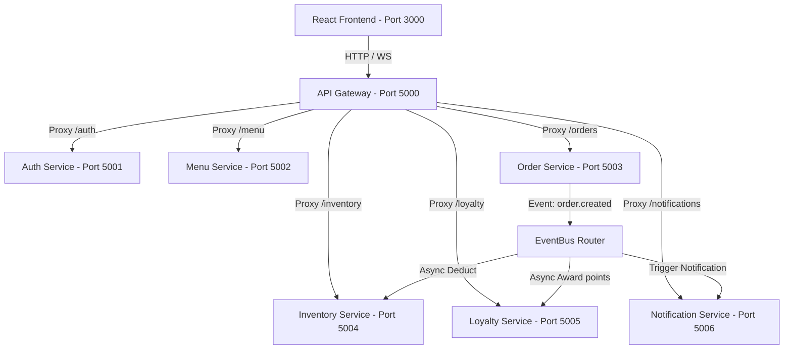

# OmniBite | Premium Multi-Cloud Restaurant Chain Monorepo

OmniBite is a production-grade, enterprise-ready monorepo platform designed for high-scale restaurant franchises or food delivery startups. Featuring decoupled microservices, real-time WebSockets tracking, automated inventory recipes deductions, and an elegant dark-theme React dashboard.

## 🚀 Architectural Overview

This platform implements a pure **microservice-oriented monorepo architecture** utilizing npm workspaces.



### Core Monorepo Folders
* **`shared/`**: Unified monorepo library containing TS structures, JWT verifiers, centralized HTTP errors middleware, and a resilient Redis-ready caching client with automatic memory fallback.
* **`services/gateway/`**: Single client entry point routing requests to microservices and hosting the socket.io Websocket hub.
* **`services/auth-service/`**: Handles user registrations, bcrypt credentials hashing, and Role-Based Access Control (RBAC).
* **`services/menu-service/`**: Branch assets and menu collections manager. Implements a mock AI-recommendation engine showing user match scores and reasons.
* **`services/order-service/`**: Places orders (Dine-in, Takeaway, Delivery) and handles table QR ordering sessions.
* **`services/inventory-service/`**: Tracks ingredient stocks per branch. Subscribes to the EventBus to deduct stocks automatically and fires low-stock events.
* **`services/loyalty-service/`**: Manages promo discount coupons and customer loyalty points cards. Recalculates user tiers on completions.
* **`services/notification-service/`**: Dispatches real-time web socket alerts to the gateway and logs events to MongoDB.

---

## 🛠️ Technology Stack

1. **Frontend**: React + Vite + Tailwind CSS (lucide-react, socket.io-client)
2. **Backend Services**: Node.js + Express + TypeScript
3. **Database Layer**: MongoDB with Mongoose (Separate databases per service)
4. **Caching Layer**: Redis (Automatic in-memory fallback included!)
5. **Real-time Engine**: WebSockets via Socket.io
6. **Communication**: EventBus Pub/Sub

## 🐳 Docker & Docker Compose

The platform ships with Dockerfiles for each microservice and a `docker-compose.yml` that orchestrates the full stack locally. Run:

```bash
docker-compose up --build
```

to spin up all services with a single command.

## 🤖 GitHub Actions CI/CD

Continuous integration and delivery is automated via GitHub Actions. The workflow builds Docker images, pushes them to Amazon ECR, and deploys to an Amazon EKS cluster on every merge to `main`. See `.github/workflows/ci.yml` for the full pipeline.

## 🌩️ Terraform & AWS EKS

Infrastructure as code is managed with Terraform. It provisions:

- VPC with public and private subnets
- EKS cluster with managed node groups
- Amazon ECR repositories for each service
- IAM roles and policies for secure access

Deploy with:

```bash
cd infrastructure
terraform init
terraform apply
```

## 📈 Monitoring with Grafana & Prometheus

The stack includes Prometheus for metrics collection and Grafana for dashboards. Pre‑configured Helm charts are provided in `k8s/monitoring`. Access Grafana at `http://localhost:3000` (default credentials: admin / admin).

---

## ⚡ Quick Start & Development Run

Follow these simple steps to spin up the entire architecture in development.

### 1. Prerequisites
Ensure you have Node.js (v18+) and a local MongoDB instance running at `mongodb://localhost:27017`.

### 2. Workspace Setup & Installation
Run standard npm installs at the root directory. This will scan all workspaces, pull dev dependencies, and link the local workspaces automatically:
```bash
npm install
```

### 3. Compile Shared Utilities
Compile the core shared module so its declarations and compiled files are available:
```bash
npm run build -w shared
```

### 4. Seed the Platform Databases
Run our master database seeder. This will connect to all isolated service databases, clear previous logs, and insert high-quality test data:
```bash
npm run seed
```
*Seeded Accounts for Testing (Password is `password123` for all):*
- **Super Admin (CEO)**: `superadmin@restaurant.com`
- **Branch Admin (Manager)**: `admin@restaurant.com`
- **Chef (Kitchen Staff)**: `kitchen@restaurant.com`
- **Customer (Jim)**: `customer@restaurant.com`

### 5. Start the Monorepo
Spin up all 7 backend services + the Vite frontend simultaneously using our unified launch command:
```bash
npm run dev
```
The React frontend dashboard will boot on [http://localhost:3000](http://localhost:3000) and the API Gateway will be listening on [http://localhost:5000](http://localhost:5000).

---

## ☸️ Kubernetes Deployment
Build the local Docker images first so the cluster can use them:
```bash
docker build -t hotel_multi_chain-auth-service:latest -f services/auth-service/Dockerfile .
docker build -t hotel_multi_chain-menu-service:latest -f services/menu-service/Dockerfile .
docker build -t hotel_multi_chain-order-service:latest -f services/order-service/Dockerfile .
docker build -t hotel_multi_chain-inventory-service:latest -f services/inventory-service/Dockerfile .
docker build -t hotel_multi_chain-loyalty-service:latest -f services/loyalty-service/Dockerfile .
docker build -t hotel_multi_chain-notification-service:latest -f services/notification-service/Dockerfile .
docker build -t hotel_multi_chain-gateway:latest -f services/gateway/Dockerfile .
docker build -t hotel_multi_chain-frontend:latest -f frontend/Dockerfile .
# If the frontend should target a Kubernetes gateway URL at build time:
# docker build --build-arg VITE_GATEWAY_URL=http://<gateway-host>:<gateway-port> -t hotel_multi_chain-frontend:latest -f frontend/Dockerfile .
docker build -t hotel_multi_chain-seeder:latest -f services/menu-service/Dockerfile .
```
Apply the cluster resources:
```bash
kubectl apply -f k8s/namespace.yaml
kubectl apply -f k8s/apps.yaml
kubectl apply -f k8s/seeder-job.yaml
kubectl apply -f k8s/monitoring/blackbox-config.yaml
kubectl apply -f k8s/monitoring/blackbox-deployment.yaml
kubectl apply -f k8s/monitoring/prometheus-config.yaml
kubectl apply -f k8s/monitoring/prometheus-deployment.yaml
kubectl apply -f k8s/monitoring/grafana-config.yaml
kubectl apply -f k8s/monitoring/grafana-deployment.yaml
```
If you want the frontend to target a cluster gateway at build time, set:
```bash
VITE_GATEWAY_URL=http://<gateway-host>:<gateway-port>
```
Access the dashboard services through your cluster LoadBalancer or port-forwarding:
- Frontend: `http://localhost:80` or via cluster external IP
- Gateway: `http://localhost:80` (if using cluster LoadBalancer)
- Grafana: `http://localhost:3000`

---

## 🔒 Verification & Tests

To compile the entire monorepo TypeScript base to production distributions:
```bash
npm run build
```
You can query direct microservice endpoints (e.g. `http://localhost:5001/health` or `http://localhost:5000/health` for the Gateway) to verify health checks.
